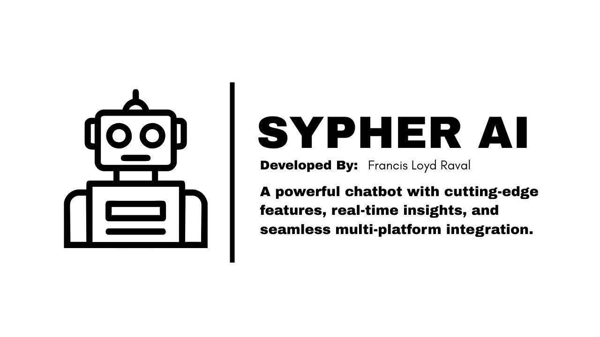

# SypherBot (HoshinoBot v4.0.0)

    



## Contents
 - [Introduction](#introduction)
 - [Features](#features)
 - [Start-Up](#start-up) 
 - [Getting Started](#getting_started)
   - [Command Layout](#command_layout)
   - [Event Layout](#event_layout)
   - [Response (Usage)](#response)
 - [Credentials](#credentials)

## Introduction

Welcome to **SypherAI** — a **next-generation, fully re-engineered evolution** of the beloved [**HoshinoBETA**](https://github.com/itsmeakhiro/HoshinoBETA) framework. Developed from the ground up by [**Francis Loyd Raval**](https://github.com/itsmehoshino), SypherAI introduces **smarter architecture, modular plugins, lightning-fast event handling**, and **AI-powered automation** that pushes the boundaries of Messenger bot development.

 This is not just an upgrade — it's a **complete reinvention** from [**HoshinoBETA**](https://github.com/itsmeakhiro/HoshinoBETA) framework. Every line of code has been rethought, optimized, and future-proofed to support **massive scalability, seamless plugin integration, and real-time adaptability**.

> _**Disclaimer**_: SypherAI is currently in active development (InDev). While extensively tested, unexpected bugs or behavior may occur. Use at your own risk and report issues immediately via [GitHub Issues](https://github.com/itsmehoshino/Sypher/issues).

**Why SypherAI?**
- **Performance-first design** with async-native core
- **Zero-downtime plugin system**
- **Built-in AI response engine** (coming soon)
- **Intuitive command & event DSL**
- **Full TypeScript & ESM support**


## Start-up
 To start up the system make sure you have the following requirements:
  - Facebook Account
  - Cookie Editor
  - Forked Sypher file

> _**Note:**_ *If you dont have the Cookie Editor Extension, you may download it [here](https://cookie-editor.com/)*

## Installing

```bash
git clone https://github.com/itsmehoshino/Sypher; cp -r Sypher/. .; rm -rf Sypher
```

## Features
- **Typescript and ESM Support**
- **Zero Downtime deployment**
- **TypeSafety function**
- **Easy built-in command and event structure**
- **AutoFonts and AutoStyler function**
- **Anti-change credentials**
- **Enhanced readability**
- **Hidden state function**
- **Enhanced and real-time settings and config**

## Getting Started
Dive into development with our streamlined onboarding process. SypherAI abstracts complexity so you can focus on creating powerful bot behaviors.

## Command Layout
Commands follow a declarative, intuitive structure:

```Typescript
const command: SypherAI.Command = {
  name: "",
  role: 0,
  usage: "",
  author: "",
  aliases: ["", ""],
  cooldowns: 0,
  description: "",
  category: "",
  config: {
   maintenance: false,
   usePrefix: false,
   limiter: {
    isLimit: false,
    limitUsage: 0,
   }
  }

  async onCall({ response }) {
    await response.send("");
  },
};

export default command;
```


## Credentials
This system was developed entirely by Francis Loyd Raval. If you want to contribute, report bugs, or request features, feel free to reach out via the following channels. Also, drop a follow to stay updated on releases and behind-the-scenes progress:

> **Facebook:** [**Francis Loyd Raval**](https://www.facebook.com/mannamedfrancis)

> **Discord:** [**Francis Loyd Ravales**](https://discord.gg/5P56MTm8)

> **Messenger:** [**Join the community**](https://m.me/j/AbZXcn8lIkd2YSOj/)
